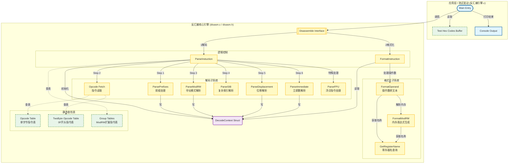
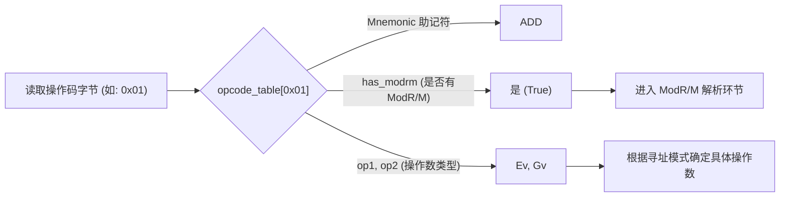
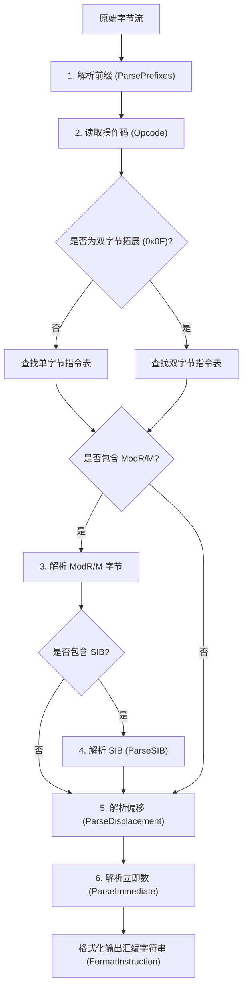

# [原创] 从零开始手写 x86 反汇编引擎：硬编码解析与架构设计全纪录

## 前言

学习逆向工程一段时间后，我们往往会遇到一个瓶颈：虽然会熟练使用 OD、x64dbg、IDA 等各种强大的反汇编与调试软件，但对底层的**指令硬编码（Opcode）**往往只停留在“认得几个常见前缀和指令”的表面层次。

为了真正打通任督二脉，夯实逆向基本功，最好的方式莫过于**亲自翻阅 Intel 白皮书（Intel® 64 and IA-32 Architectures Software Developer Manuals），从零手写一个 x86 反汇编引擎**。

本项目正是在这样的初衷下诞生的。为了方便学习且符合人类直觉，本引擎**大量完全按照 Intel 白皮书的表格结构来查表并填充数据**。在这篇分享中，我将毫无保留地分享我用 C 语言实现这款轻量级 x86 反汇编引擎（Disassembler）的架构设计、核心逻辑、FPU 浮点解析，以及踩过的各种硬编码解析的坑。希望对正在学习硬编码或者想要自己动手写轮子的朋友有所启发！

---

## 一、 引擎核心特点预览

在动手写代码之前，我们需要明确目标。本项目的反汇编引擎做到了以下几点：
1. **纯 C 语言编写**：不依赖任何第三方复杂库，代码极度精简、纯粹，方便跨平台移植或直接嵌入 PE 工具、内核驱动中。
2. **严格贴合 Intel 白皮书的表驱动架构（Table-Driven）**：通过精心设计的一维和多维数组表来处理庞杂的 x86 指令集，彻底摆脱杂乱的 `if-else`。
3. **完整的指令生命周期解析**：支持 **Prefix -> Opcode -> ModR/M -> SIB -> Displacement -> Immediate** 的标准 x86 解析流程。
4. **精细的 FPU 与 Group 指令支持**：针对 `0xD8~0xDF` 的浮点指令族，以及 `0x80`、`0x83` 等“组指令”进行了细致的分发处理。
5. **支持指令格式化**：将内存字节流完美还原并格式化为标准 Intel 汇编语法。

---

## 二、 整体架构与数据结构设计

任何庞大的解析系统，数据结构都是灵魂。x86 指令长度不定（1~15 字节），要想有条理地解析它，首先得定义好我们的“操作数类型”和“解码上下文”。
这个图展示了代码的静态组织结构和逻辑依赖关系。


### 1. 操作数类型抽象 (`OperandType`)

在 x86 中，一个操作数可能是寄存器、立即数、内存寻址、端口、FPU 堆栈等等。我们在 `disasm.h` 中定义了一个庞大的枚举 `OperandType`，正是对应了 Intel 手册中对操作数的代号描述：

```c
typedef enum {
    NONE = 0,
    Gb, Gw, Gv, Gz,   // G: 通用寄存器，b/w/v/z 表示不同大小
    Eb, Ew, Ev,       // E: 内存或寄存器（受 ModR/M 控制）
    Ib, Iw, Iz, Iv,   // I: 立即数（受操作数大小前缀影响）
    Jb, Jz,           // J: 跳转相对偏移
    M, Mv,            // M: 纯内存操作数
    OP_AL, OP_rAX,    // 硬编码的特定寄存器（针对隐式操作数指令）
    M_F32, M_F64,     // FPU 各种内存精度
    // ...
} OperandType;
```

### 2. 指令表设计：引擎的心脏 (`OpcodeEntry`)

想要摆脱无限的 `switch-case`，我们采用硬编码查表法。定义了 256 大小的结构体数组（针对单字节指令）。每读取一个字节的 Opcode，不仅能拿到它的助记符，还能准确拿到它所需的后续结构和操作数类型：

```c
typedef struct {
    const char* mnemonic;   // 助记符
    bool is_prefix;         // 是否是前缀？
    bool has_modrm;         // 是否带有 ModR/M 字节？
    OperandType op1, op2, op3; // 涉及的操作数类型
    GroupEntry* group_table;// 如果存在 Group 扩展，指向次级表
} OpcodeEntry;
```

---

## 三、 教你如何查阅 Intel 白皮书填表

为了让解析符合直觉，我们的 `opcode_table` 数据结构是彻头彻尾地照着 Intel 手册附录 A 的 **One-byte Opcode Map (Table A-2)** 来填写的！

打开 Opcode Map 表，这是一个按照高低半字节划分的二维网格（行代表高 4 位，列代表低 4 位）。以表中第一行（行为 `0`）为例，你可以清晰看到 `ADD` 指令的分布：
- 第 `0` 列（Opcode `0x00`）：表格内写着 `ADD`，下方填写的参数是 `Eb, Gb`。
- 第 `1` 列（Opcode `0x01`）：表格内写着 `ADD`，下方填写的参数是 `Ev, Gv`。
- 第 `4` 列（Opcode `0x04`）：表格内写着 `ADD`，下方填写的参数是 `AL, Ib`。

是不是看着非常眼熟？没错，表格里用来表示操作数类型的这些神秘代号（`Eb`, `Gv`, `Ib` 等），正是我们在前一节 `OperandType` 枚举中原汁原味定义好的符号！

在我们的引擎中，相当于直接将这张表“翻译”并抄下来，转化为 C 代码：
```c
const OpcodeEntry opcode_table[256] = {
    // 0x00: 查表得 ADD，操作数1是 Eb (r/m8)，操作数2是 Gb (r8)
    [0x00] = {"ADD", 0, HAS_MODRM, Eb, Gb, NONE, NULL},
    
    // 0x01: 查表得 ADD，操作数1是 Ev (r/m16/32)，操作数2是 Gv (r16/32)
    [0x01] = {"ADD", 0, HAS_MODRM, Ev, Gv, NONE, NULL},
    
    // 0x04: 查表得 ADD，操作数1隐式是 AL，操作数2是立即数 Ib (imm8)
    [0x04] = {"ADD", 0, 0, OP_AL, Ib, NONE, NULL},
    // ...
};
```
你看，这样的表格映射是否极其符合人类直觉？查表的过程如下图所示：



---

## 四、 x86 深度解析流水线 (The Pipeline)与核心函数

有了数据结构，解码函数其实就是一条流水线：



### 📌 核心 API 函数一览

为了保持架构的纯粹性，所有的逻辑被拆分为了几个职责分明的核心函数：
- `int Disassemble(uint8_t* buffer, uint32_t eip, DecodeContext* out_ctx)`：顶层暴露给外界的接口，传入机器码字节流和当前 EIP，传出完全解析并格式化好的结构体，并返回该条指令占用的总字节数。
- `int ParseInstuction(...)`：核心的解码流水线引擎（也就是实现上面流程图的主轴）。负责按照顺序依次调用 `ParsePrefixes`、查找 Opcode、分发处理 SIB 及 Immediate 等逻辑。
- `void ParseModRM/ParseSIB/ParseDisplacement/ParseImmediate`：四剑客，在解码流水线中针对性地剥离数据填充到上下文中。
- `void FormatInstruction/FormatOperand`：专门做“苦力活”的打印函数，将解析出来的硬核二进制状态如（Mod=0, Reg=2, disp=0x10 等），优雅地转化为类似 `DWORD PTR FS:[EAX+ECX*4-0x10]` 的性感字符串。

### 📌 重点坑位：ModR/M 与 SIB 寻址迷宫

ModR/M 规定了操作符的寻址方式：
- `Mod` (2 bit)：决定寻址模式（寄存器、无偏移内存、8位偏移、32位偏移）。
- `Reg` (3 bit)：通常代表一个寄存器（比如加法里的目标寄存器），但在 Group 指令中，它代表**Opcode 的扩展**！
- `R/M` (3 bit)：决定基址寄存器。如果 R/M = 4 且 Mod != 3，说明后面**还紧跟着一个 SIB 字节**！

解析代码极具位运算的美感：
```c
void ParseModRM(DecodeContext* ctx) {
    uint8_t b = ctx->buffer[ctx->pos++];
    ctx->modrm = b;
    ctx->mod = (b >> 6) & 0x03;
    ctx->reg = (b >> 3) & 0x07;
    ctx->rm  = b & 0x07;

    // SIB 千层套路：当 rm == 4 且模不是寄存器(mod != 3)时，必须带 SIB
    if (ctx->mod != 3 && ctx->rm == 4) {
        ctx->has_sib = true;
    }
}
```
紧接着解析 **SIB（Scale, Index, Base）**。这里有深坑：如果 `Index == 4`，实际上代表没有 Index（因为 ESP 不能做变址）；如果 `Base == 5` 且 `Mod == 0`，代表没有寄存器基址，只有一个单纯的 32位 Displacement！

### 📌 Group 扩展指令组

遇到 `0x80`、`0x81` 这一类指令时，单纯查 `opcode_table` 你只能得到它是算术底层组，根本不知道它是 `ADD` 还是 `SUB`。秘密藏在刚才提到的 **ModR/M 的 `Reg` 字段**里！
在引擎设计中，我专门做了一个 `group_tables` 二维数组，如果 `opcode_table[0x80]` 指向了 `group_tables[0]`，我们立刻取出刚解析的 `ctx->reg` 进行二次查表。这种二级表映射极其优雅地解决了 x86 操作码拥挤度过高的问题。

---

## 五、 硬核揭秘：FPU 浮点数指令解析

很多人手写计算器或反汇编器时，都会在 FPU 指令前止步。x87 浮点指令集中分布在 `0xD8 ~ 0xDF` 这个区间。

FPU 的恶心之处在于，同一个 Opcode（例如 `0xD8`），**如果你后面跟的 ModR/M 字节的 Mod 字段是不是 3，它的含义完全不同！**
- 如果 `Mod != 3`，说明是内存寻址，操作数通常是一个 32位/64位 内存浮点数。
- 如果 `Mod == 3`，说明是 FPU 寄存器寻址，它变成了对寄存器堆栈 `ST(0), ST(i)` 的操作。

在我们的引擎中，我专门编写了 `ParseFPU` 分发器来进行精准狙击：
```c
void ParseFPU(DecodeContext* ctx) {
    uint8_t op = ctx->opcode;
    uint8_t mod = ctx->mod;
    uint8_t reg = ctx->reg;
    uint8_t rm = ctx->rm;

    switch (op) {
        case 0xD8:
            if (mod != 3) {
                // 内存操作
                ctx->entry.op1 = M_F32; // 明确指出是一个 32位 内存浮点数
                switch (reg) {
                    case 0: ctx->entry.mnemonic = "FADD"; break;
                    case 1: ctx->entry.mnemonic = "FMUL"; break;
                    // ...
                }
            } else {
                // 寄存器操作
                ctx->entry.op1 = OP_ST0;
                ctx->entry.op2 = OP_STi; // 指望后面的 rm 字段来确定 ST(i)
                switch (reg) {
                    case 0: ctx->entry.mnemonic = "FADD"; break;
                    case 1: ctx->entry.mnemonic = "FMUL"; break;
                    // ...
                }
            }
            break;
        // 其他 0xD9 ~ 0xDF 同样处理...
    }
}
```
通过分离 `mod == 3` 与否的状态空间，并在结构体内植入 `M_F32/M_F64` 以及 `OP_STi` 的动态代号标识，FPU 最复杂的寄存器堆栈与内存寻址就被瞬间磨平。

---

## 六、 测试通过与效果展示

千行代码见真章，造好轮子当然要下地跑一跑。在 `main` 函数的测试驱动中，我设计了**两种不同的测试模式**：

### 1. 终极边缘用例大考场（硬编码数组单元测试）
我精心构造了一个 `test_hex_codes` 数组，里面硬编码了涵盖各种极端边缘情况的机器码，包括花式 `0x66` 前缀、段寄存器覆盖、极品 SIB 寻址组合和冷门的 FPU 浮点运算，专门用于打乱状态机的严苛测试考验。

### 2. 结合自有 PE 解析库实战拉练（硬核实盘反汇编）
不仅能玩小打小闹，它还被我集成了早前手写的 **PE 格式解析工具 (`PETools.c`)**。只需要提供一个 `exe` 目标路径（比如 `windbg.exe`），引擎便会：
- 自动读取 PE 文件结构并映射到内存中的 ImageBuffer；
- 遍历节表（Section Headers）精准定位含有 `IMAGE_SCN_CNT_CODE` 属性的代码段（如 `.text`）；
- 找出 `VirtualAddress` 后，无缝开始对真实被编译出来的二进制机器码进行地毯式的连续解析输出！

*（目前为了方便演示各种坑位，这里放出来的是第一种测试模式下终端输出的效果）*

跑起来的输出令人感到极致顺滑：


所有的字节流被完美还原出了对应的硬编码及正确的汇编指令结构，包含段寄存器覆盖、正确的内存寻径解析，以及复杂的浮点 FPU 指令。

### 3. 反汇编覆盖率与性能考量（得与失）

经过大量的真实 EXE 解包与测试，我们发现：**对于大部分常规 x86 程序，本引擎的支持覆盖范围已经基本接近了 OllyDbg 等成熟调试器的呈现效果**。只要不是极为偏门且较新的 SIMD 扩展指令，经典 x86 指令全家桶它都能精准拿捏。

**但是，既然是造轮子，就必须讲究得失的权衡。**
在此我必须向各位读者说明本引擎的一个重要缺陷：本着“**为零基础学习者服务，逻辑极致清晰，且完全符合人类直觉**”的设计初心，我在代码编写时**主动牺牲了蛮多运行效率**。
- 为了代码易懂，内部多次进行了复杂结构体的拷贝传递与 `snprintf` 高频次字符串格式化拼接。
- 绝大多数解码判定都使用了结构体成员的显式赋值（如 `has_modrm = true`）和普通分支，并没有特意使用极客思维的位运算、状态树压缩表（像是商业反汇编引擎那样）来压榨极限性能。

因此，如果你想要用它去完成千万行级别汇编代码的极速静态扫描，它的效率会有明显瓶颈。但作为初级阶段**逆向硬编码的教科书级实战项目**，它舍弃的这点效率换来的是“零门槛的可读性”。一旦你读懂了它，想在此基础上优化性能便只是个人的工程问题罢了。

---

## 七、 结语与悬念预告

亲手搓一个能解析上千种 x86 组合的反汇编引擎是一段硬核的修行。
这个过程让我对机器码有了全新的敬畏感与掌控感：原来我们觉得天书一样的 `FF 15` 后面的 `15`，它的二进制刚好拆分成 Mod=0, Reg=2(CALL扩展), RM=5。原来花指令里植入的垃圾数据，是为了利用解析器的状态机缺陷。通过严格研读 Intel 白皮书，表驱动设计真的是编程之神。

**这是结束吗？不，这只是个开始。**

读懂了汇编，那能不能**执行**汇编？
既然反汇编引擎已经能把一条指令精确分解成 `Opcode`、`op1`、`op2`，那我干脆再往前迈一步——**自己写一套 CPU 寄存器上下文环境，给这套引擎再加上一套执行流！**

没错，在完全手撕完这个解析器后，我又硬核爆肝，在上面套了一层壳，写出了一个 **属于自己的纯 C 语言 x86 汇编虚拟解释器（x86 Virtual CPU Emulator）**，不仅能单步调试，还能模拟堆栈调用！

**如果这篇反汇编引擎的文章大家觉得有帮助，反馈热烈的话，下一篇我将开源并为大家全面解析那个“x86 汇编虚拟解释器”的实现原理！**

**感谢阅读，欢迎各位大佬批评指正和留言交流！** 逆向的浪漫，正是亲手撕开黑盒建立掌控感的过程，不是吗？

